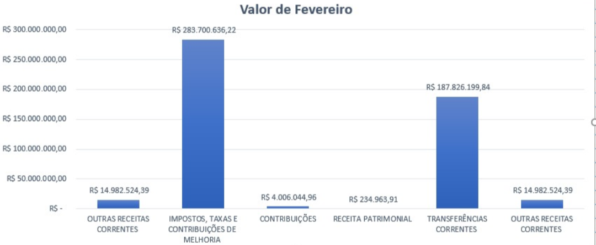
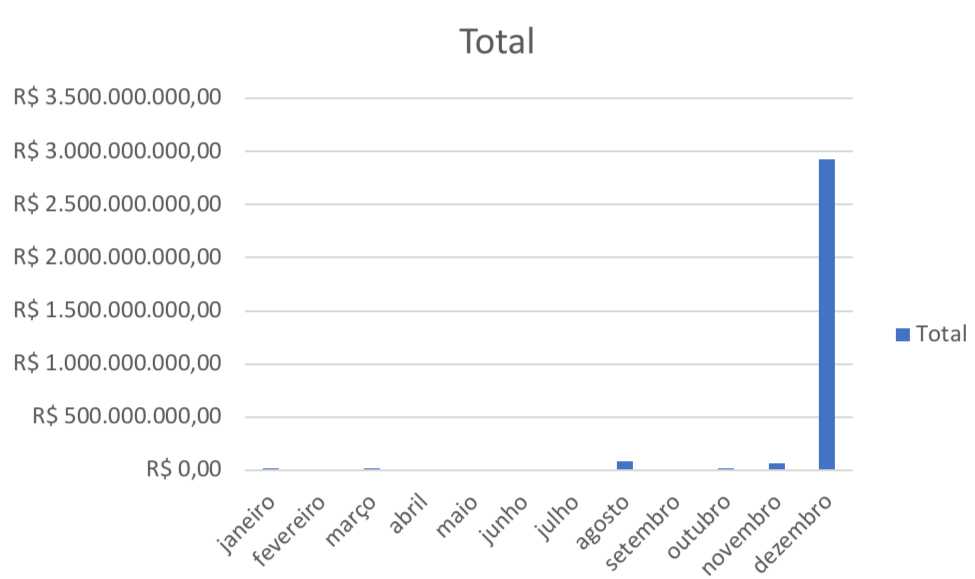

# Informatica-excel
Atividade com foco em introdução no 
programa Excel realizadas na disciplina 
de informática do CSP em logística

#  1.1 Atividade realizada com excel(planilha fornecedores)

[Acessar planilha fornecedores de fevereiro](https://1drv.ms/x/c/1538405D4ACAB88C/IQCneSBzAMbISa5nrB5epFoQAUYQrj1vUdZoY4_9yD8L-aU?e=ls4Jgb)

# 1.2 Atividade realizada com excel(planilha receita)
[Acessar planilha receita](https://1drv.ms/x/c/1538405D4ACAB88C/IQAj0IKZRQ9ySbZ1RYudro3FAfgea1tW2RnP2n447yoZcKY?e=bHwUWM)

# atividade 3
escolher um tema dos dados abertos de são Paulo e fazer 5 perguntas dos dados escolhidos no Excel
https://drive.google.com/drive/folders/1HaXAqX1X6YvJXZ9ixiyNcUmN3PSrA3V6

# atividade 4
realizar um dos cursos oferecido pela professora

