# Informatica
Atividades com foco em introdução no 
programa Excel,Power bi, python realizadas na disciplina 
de informática do CSP em logística

# atividade teste
gráfico da Prefeitura de São José dos Campos
[📂 Abrir Planilha](https://docs.google.com/spreadsheets/d/1qx-28JSFd4pCIbSEB9wxCx63hEhNIQjt/edit?usp=drivesdk)
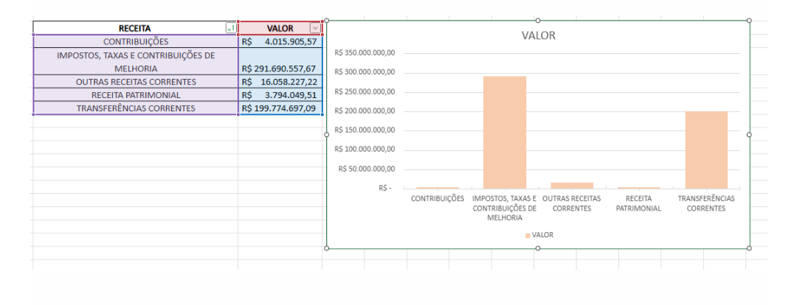

#  1.1 Atividade realizada com excel(planilha fornecedores)

[Acessar planilha fornecedores de fevereiro](https://1drv.ms/x/c/1538405D4ACAB88C/IQCneSBzAMbISa5nrB5epFoQAUYQrj1vUdZoY4_9yD8L-aU?e=ls4Jgb)

# 1.2 Atividade realizada com excel(planilha receita)
[Acessar planilha receita](https://1drv.ms/x/c/1538405D4ACAB88C/IQAj0IKZRQ9ySbZ1RYudro3FAfgea1tW2RnP2n447yoZcKY?e=bHwUWM)

# atividade 2 Gráfico de Multas Pagas do Governo do Estado de São Paulo - 
[📊 Abrir Planilha](https://docs.google.com/spreadsheets/d/14oImYYvsgN--XG6L-6UVJcQLgyW57K4K/edit?usp=drivesdk)
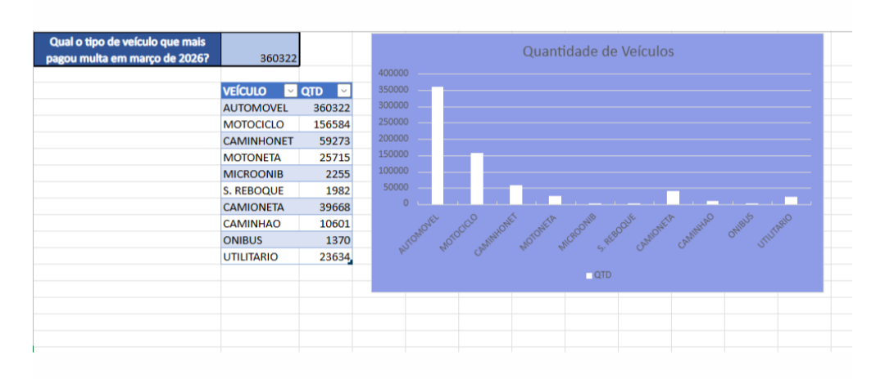

# atividade 3
escolher um tema dos dados abertos de são Paulo e fazer 5 perguntas dos dados escolhidos no Excel
https://drive.google.com/drive/folders/1HaXAqX1X6YvJXZ9ixiyNcUmN3PSrA3V6

# atividade 4
realizar um dos cursos oferecido pela professora

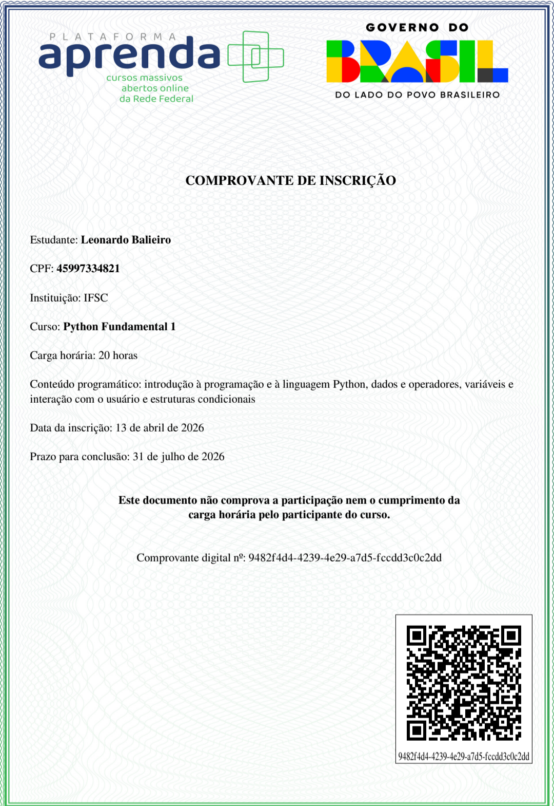

# atividade 5
realizar curso da escola do trabalhador 4.0 de análise de dados do power bi
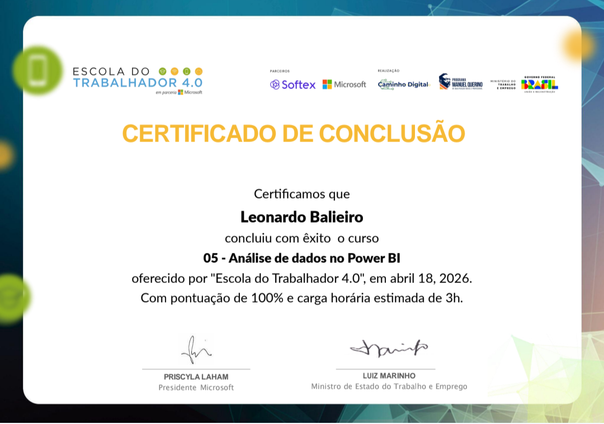

# atividade 6
sinistro do estado de SP
[📊 Baixar Projeto: SINISTROSP.pbix](./SINISTROSP.pbix)
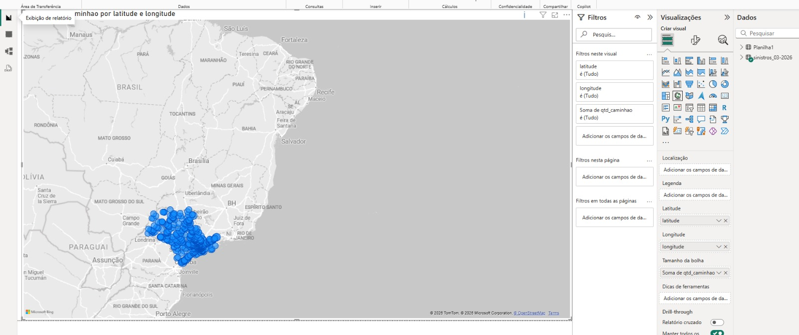

# atividade 7
usando o powerbi com os dados abertos sp trabalho-emprego-formal-municípios do estado de são Paulo para responder 2 perguntas que a professora gerou
# 1° PERGUNTA
qual ano e mês o saldo de transferência foi menor ?
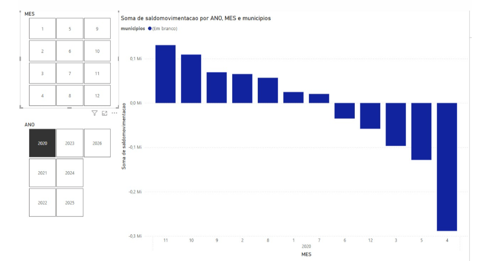

trabalho-emprego-formal-municípios do estado de são Paulo criando e respondendo 2 perguntas que foram criadas por nós alunos.

# 1° PERGUNTA
qual ano e mês teve o maior saldo de rejeição?

resposta: o ano foi 2025 e o mês foi fevereiro.

resposta: o ano foi o 2020 e o mês foi abril.

# atividade 7
usar os dados abertos de SP, escolher um deles e criar três visualizações 
[📊 Clique aqui para aceder ao ficheiro Conjunto de Dados](https://github.com/Leonardacostabalieiro/-Inform-tica-excel/blob/main/conjunto%20de%20dados.pbix)

# atividade 8
tratamentos de dados formula DAX
[📊 Abrir arquivo Fórmulas DAX no GitHub](https://github.com/Leonardacostabalieiro/-Inform-tica-excel/blob/main/formulas%20dax.pbix)

# atividade 10
planilha sorvete vs temperatura de gráfico linear
pelo Excel e Google colab

[Abrir planilha](https://centropaulasouza-my.sharepoint.com/:x:/g/personal/leonardo_balieiro_aluno_cps_sp_gov_br/IQC7MCdzkbXSRaGAbCnPrylQAeoMGHn6dvfCeSKw9Nfpknk?email=leocbalieiro%40gmail.com&e=CODTrr)
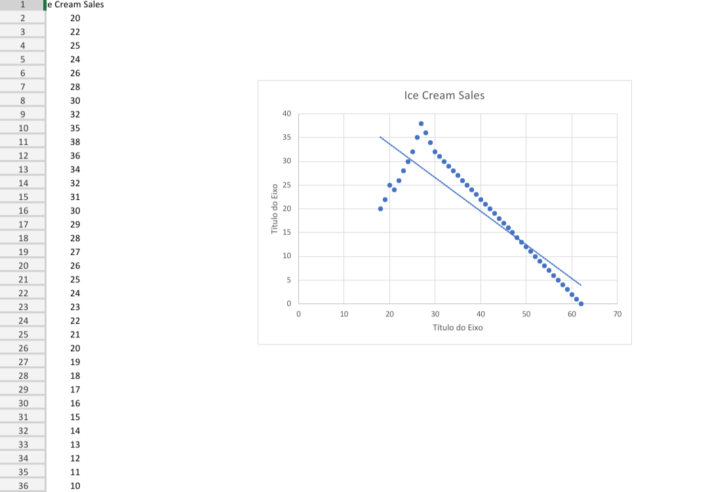
Google Colab
[Abrir no Google Colab](https://colab.research.google.com/drive/11afMnBjXucy0cU-k9hQfQ_7FDDq2m31G?usp=sharing)
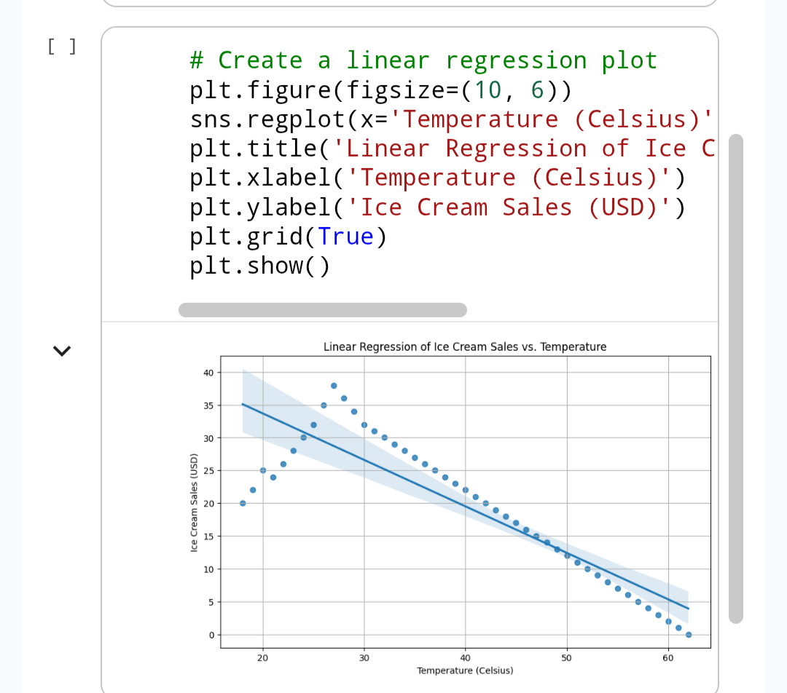

# atividade 11
planilha de gráfico linear, sobre a qualidade do vinho, com Excel e Google colab

[Abrir planilha](https://docs.google.com/spreadsheets/d/1S4SZKAuqh6_PZTJYRe_Egp5Q2iSEqmSW/edit?usp=drivesdk&ouid=103611473719355270893&rtpof=true&sd=true) 
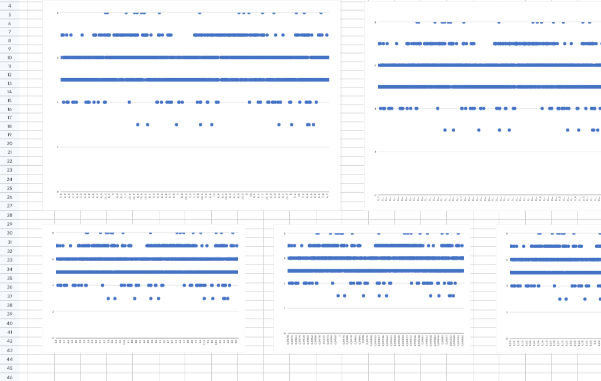

[Abrir no Google Colab](https://colab.research.google.com/drive/1W6sz7oED0BQljXauWBz4vigeiXT92OZT?usp=sharing)
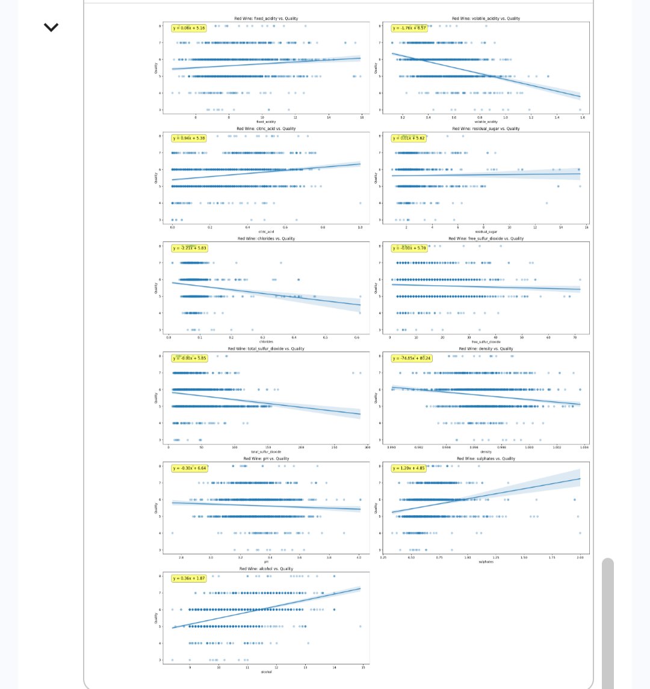

# atividade 12
relação de vendas medias entre sorvetes e cervejas. tratamento pelo Excel e powe bi
[📊 Acessar Projeto: tratamento power bi.pbix](https://github.com/Leonardacostabalieiro/-Inform-tica-excel).
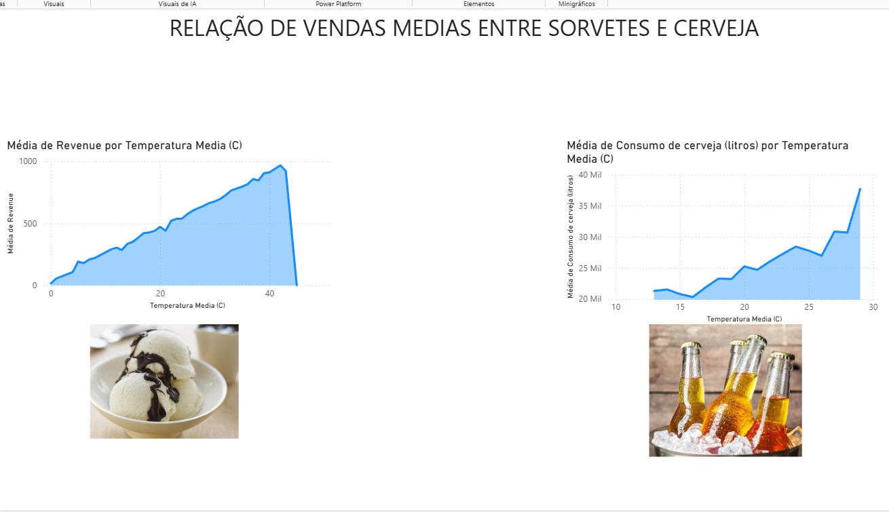

# avaliação 28/05/2026
[📊 Baixar Projeto: indicadores de nupcialidade.pbix](./indicadores%20de%20nupcialidade.pbix)
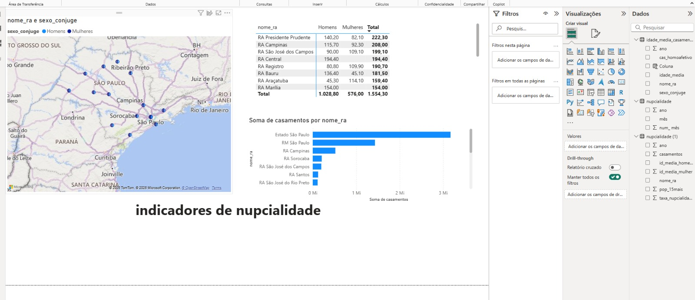

